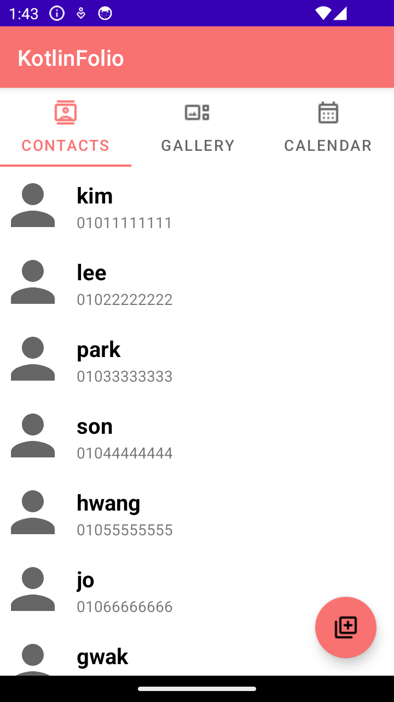

# KotlinFolio

### 슬로건asdf

***
{한줄 설명?}
***


## 개발 팀원

- **[김성아](https://github.com/kimseongah)** : 한양대학교 컴퓨터소프트웨어학부 20학번
- **[김기현](https://github.com/surface03)** : KAIST 전산학부 22학번

## 개발 환경
- Language: Kotlin
- OS: Android

```
minSdkVersion 26
targetSdkVersion 34
```

- IDE: Android Studio
- Target Decive: Galaxy S7

## 기술 스택


## 애플리케이션 설명

- 3개의 탭으로 이루어진 애플리케이션입니다.
- 연락처, 갤러리를 추가하고 수정할 수 있습니다.
- 나만의 연락처, 갤러리를 달력에 연동할 수 있습니다.


### Tab 1
- tab1은 연락처를 저장합니다. 연락처를 저장할 때 그 사람에 대한 정보를 저장할 수 있는 나만의 연락처를 가질 수 있습니다.
    - **기존 데이터 불러오기**
        
        

### Tab 2
- tab2의 주제는 "나만의 갤러리" 입니다. 사진과 사진의 정보를 저장할 수 있습니다. 
  - 이때, 저장 가능한 사진의 정보는 사진 제목, 사진 설명, 사진을 추가한 날짜입니다.
  - **저장된 정보**
- 사용자로부터 디바이스 파일 접근 권한을 요청합니다. 사용자가 수락하면, 사용자의 핸드폰에 저장된 사진을 선택할 수 있는 창이 뜨게 되고, 선택한 사진을 갤러리에 추가할 수 있습니다.
- 

### Tab 3
- 설명


## 사용된 기술
- 전체적인 구현 설명
- 애플리케이션 설명 부분과 합쳐도 될 것 같다.
### Tab 1
- 설명
### Tab 2
- 
### Tab 3
- 설명


## 다운로드

- [APK 다운로드](https://www.google.com)
