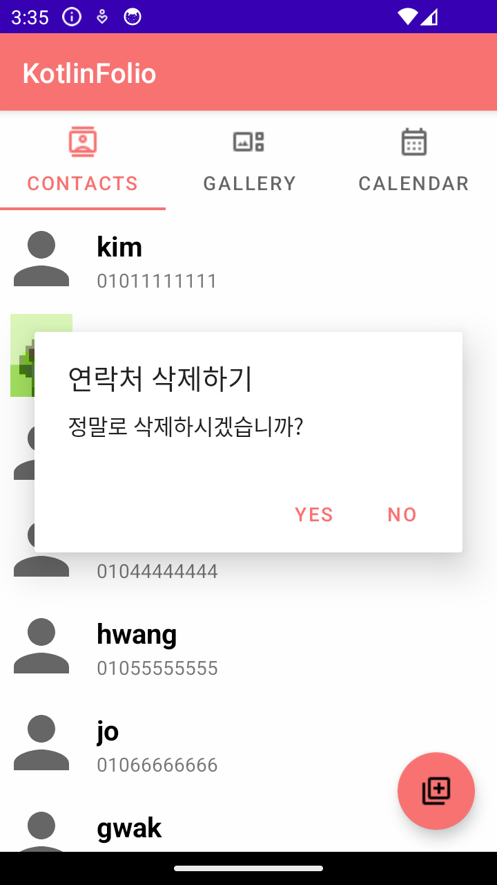

# KotlinFolio
<p align="center"></p>

### 슬로건

***

***


## 개발 팀원

- **[김성아](https://github.com/kimseongah)** : 한양대학교 컴퓨터소프트웨어학부 20학번
- **[김기현](https://github.com/surface03)** : KAIST 전산학부 22학번

## 개발 환경
- Language: Kotlin
- Database: 
- OS: Android

```
minSdkVersion 26
targetSdkVersion 34
```

- IDE: Android Studio
- Target Decive: Galaxy S7


## 애플리케이션 설명
- 전체적인 설명
- 3개의 탭으로 이루어진 애플리케이션입니다.
- 나만의 연락처, 갤러리를 달력에 연동할 수 있습니다.
- 연락처, 갤러리를 추가하고 수정할 수 있습니다.


## Tab 1
- Tab1은 연락처를 저장합니다. 연락처를 저장할 때 그 사람에 대한 정보를 저장할 수 있는 나만의 연락처를 가질 수 있습니다.
    - **기존 데이터 불러오기**
        
        

    - **연락처에 대한 정보 저장**

        
        
        
    
    - **연락처 추가**
    
        
        

    - **연락처 데이터 수정**
    
        
        
        

    - **연락처 사진 수정**

        
        
        
    
    - **연락처 삭제**
    
        
        
        

    - **앱 종료 후에도 데이터 유지**


        
#### Tab 2
- 설명
#### Tab 3
- Tab3는 Tab1과 Tab2에서 저장한 메모와 사진을 날짜 별로 볼 수 있는 캘린더입니다. 날짜를 클릭하면 사용자가 저장한 정보들을 한 눈에 볼 수 있습니다.

    - **연락처에 대한 정보 저장**
        
        날짜를 클릭하면 해당 날짜에 저장한 정보 또는 수정한 정보가 나옵니다.

        
        
        
       

## 사용된 기술
- 전체적인 구현 설명
- 애플리케이션 설명 부분과 합쳐도 될 것 같다.
#### Tab 1
- **기존 데이터 불러오기**
    
    - assets 폴더에 data.json을 저장하여 초기 데이터 구축합니다.
    - Gson 모듈로 json 파일을 Person 클래스 리스트로 저장합니다.
    


#### Tab 2
- 설명
#### Tab 3
- **Tab1, 2와 데이터 연동하기**

        class SharedViewModel : ViewModel() {
            val persons = MutableLiveData<List<Person>>()
            val images = MutableLiveData<List<GalleryImage>>()
        }
    View Model 이용해서 데이터 공유 및 변경 시에 업데이트가 가능합니다.

## 다운로드

- [APK 다운로드](https://www.google.com)
